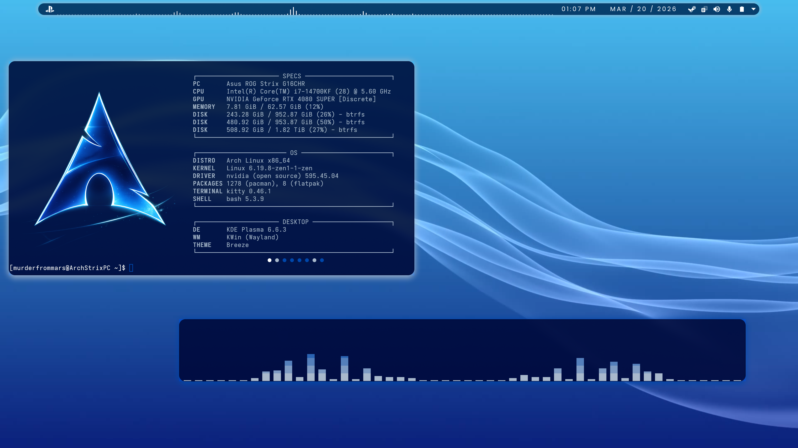
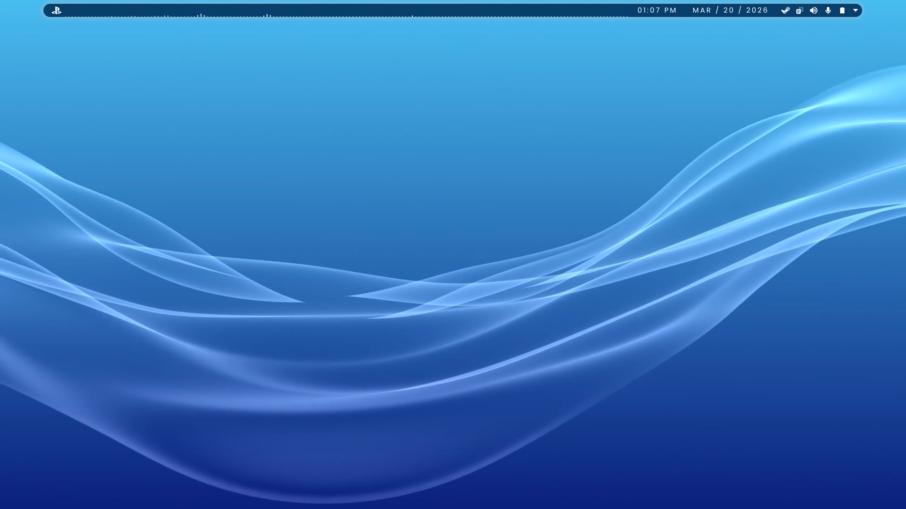

# Playstation 4 Plasma — PS4 Inspired KDE Theme

**Playstation 4 Plasma** is a PlayStation 4-inspired theme for **KDE Plasma 6** that transforms Plasma into a sleek, dynamic tiling window manager setup with a signature PS4 cobalt aesthetic and productivity-focused workflow enhancements.

Playstation 4 Plasma integrates advanced visual effects, KWin scripts, a live video wallpaper, and curated configurations to deliver a fully immersive PS4 desktop experience.





---

## Quick Install

The easiest way to install Playstation 4 Plasma on your system:
```bash
curl -fsSL https://raw.githubusercontent.com/MurderFromMars/Playstation-4-Plasma/main/install.sh | bash
```

This command downloads the installer and deploys the full PS4 Plasma environment automatically.

---

## Features

**Visual Enhancements:**
- PS4 cobalt color scheme (`PS4.colors`) with `#0047ab` accent
- YAMIS icon theme
- Modern Clock Plasma widget
- Live video wallpaper via Smart Video Wallpaper Reborn
- Custom PS4 wallpapers and icons

**Window Management:**
- **Krohnkite:** dynamic tiling KWin script
- **Kyanite:** true GNOME-style dynamic workspace management for Plasma 6, authored by me
- Plasma panel colorizer
- Kurve Cava powered audio visualizer for KDE Panels
- KDE Rounded Corners custom window rounding and shadow/border effects
- Better Blur DX for blur effects on transparent windows

**Configuration Management:**
- Automatic backup of your existing configuration files
- Deployment of preconfigured Plasma and KWin configuration files including btop, kitty, fastfetch, and cava configurations
- Auto rebuild system for KDE Rounded Corners and Better Blur DX after KWin updates

**Advanced Automation:**
- Removes existing Plasma panels safely during deployment
- Applies Breeze window decoration automatically
- Activates the video wallpaper programmatically via JavaScript fallback
- Reconfigures KWin automatically after changes

---

## Supported Platforms

- **Arch / Arch-based**
- **Debian / Ubuntu-based**
- **Other distributions** — Not officially supported

**Requirements:**
- KDE Plasma 6.x
- Bash shell
- Active Plasma session
- Internet connectivity
- Sudo privileges
- Wayland only

---

## Technology Highlights

- **Bash Automation:** orchestrates builds, configuration, and deployment
- **KDE JavaScript Integration:**
  Playstation 4 Plasma uses inline JavaScript via `qdbus6` to:
  - Remove live Plasma panels
  - Activate the video wallpaper programmatically
  - Interact with KDE Plasma APIs directly

- **Source Builds:**
  Components like `KDE Rounded Corners`, `Kurve`, and `Plasma Panel Colorizer` are built from source for performance and stability.

- **Bundled Wallpaper Plugin:**
  `Smart Video Wallpaper Reborn` is shipped directly in the repository and installed locally — no KDE Store interaction required.

- **Auto Rebuild Hooks for KWin Effects:**
  Playstation 4 Plasma ensures compatibility after KWin updates:
  - **Arch:** pacman hook executes `/usr/local/bin/rebuild-kwin-effects.sh` post-kwin upgrade
  - **Debian/Ubuntu:** APT post-invoke hook triggers rebuild if kwin packages were updated

---

## Installation Details

Playstation 4 Plasma performs the following phases automatically:

### Phase 1: System Preparation
- Clone or update the Playstation-4-Plasma repository
- Detect Linux distribution
- Install system dependencies (Arch or Debian-based)

### Phase 2: Building Core Components
- Compile Plasma Panel Colorizer, Kurve, KDE Rounded Corners, and Better Blur DX
- Set up auto-rebuild scripts for KDE Rounded Corners and Better Blur DX

### Phase 3: Theme Deployment
- Stop PlasmaShell and remove old panels
- Deploy icons, wallpapers, color scheme, video wallpaper plugin, and widgets
- Apply preconfigured Plasma and KWin configuration files
- Patch desktop activity ID for correct wallpaper binding
- Activate video wallpaper via plasmashell scripting
- Activate KWin scripts:
  - **Krohnkite:** dynamic tiling
  - **Kyanite:** true GNOME-style dynamic workspace management, fully dynamic and adaptable to your workflow
- Enforce Breeze window decoration
- Reconfigure KWin and restart PlasmaShell

---

## Backup Strategy

All modified files are backed up to:
```
~/PS4-Plasma-backup-YYYYMMDD_HHMMSS
```

This allows you to restore previous configurations manually if needed.

---

## Post-Installation

- **Logout or reboot** is required to fully apply all theme and script changes.
- If the video wallpaper did not apply automatically, set it manually via:
  **System Settings → Wallpaper → Smart Video Wallpaper Reborn**
  and point it at `/usr/local/share/wallpapers/ps4wallpaperlive.mp4`

---

## Maintenance

- Automatic rebuild hooks ensure KDE Rounded Corners and Better Blur DX remain compatible after KWin updates:
  - Arch: pacman hook
  - Debian/Ubuntu: APT post-invoke hook
- Rebuild logs are saved at:
```
/var/log/kde-rounded-corners-rebuild.log
/var/log/better-blur-dx-rebuild.log
```

---

## Audience

**Intended for:**
- KDE Plasma 6 enthusiasts
- Users seeking a PS4-inspired dynamic tiling workflow
- Anyone on supported Linux distributions who wants a clean, cohesive PlayStation aesthetic with the creature comforts of Plasma

---

## License

Playstation 4 Plasma is distributed under the MIT license. All projects built by, or included in, the script retain their original licensing.
